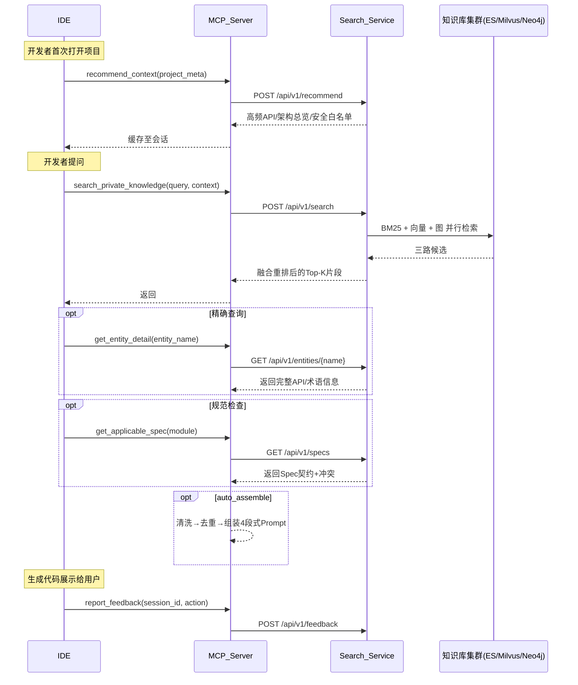

# 私域知识自动检索 MCP Server —— 工具接口详细设计

## 版本历史
| 版本 | 日期 | 变更说明 |
|------|------|----------|
| v1.0 | 2026-05-09 | 基于积分服务与SSO集成场景推演后的正式设计 |
| v1.1 | 2026-05-10 | 新增assemble_prompt工具，补充Prompt组装流水线详细设计 |
| v1.2 | 2026-05-10 | 引入Search Service微服务架构，新增auto_assemble参数、Remote引擎切换、KnowledgeType.document |
| v1.3 | 2026-05-10 | assemble_prompt来源感知分组：SDK源码 vs 文档分开展示，knowledge_source字段 |
| v1.4 | 2026-05-11 | 工具描述优化：添加中文触发关键词和场景说明；包更名为 inner-sdk-search-mcp |
| v1.5 | 2026-05-11 | assembler SDK 条目显式标注 import/返回类型/版本号；code_parser content 改为全限定类名格式 |
| v1.6 | 2026-05-20 | SDK 角色体系：entry_point/public_api/internal 标注 + 排名加成 + 条件入口提示 |
| v1.7 | 2026-05-21 | assembler 返回值类型链分组：entry_point 方法绑定其返回值接口的方法（正向+反向），增强调用链导航 |
| v1.8 | 2026-05-22 | 对齐当前代码实现：修正第1/2/6章的入参类型、枚举值、返回结构（found/message、AssemblePromptInput 包裹、sanitization action 枚举等） |
| v1.9 | 2026-05-25 | **构造入口指引**：assembler `_build_entry_hint` 根据 `construction_pattern` 生成精确构造指引（builder/static_factory/singleton/constructor）；**search_private_knowledge** 新增 `construction_guide` 字段返回构造指引明文 |

---

## 设计原则

| 原则 | 说明 |
|------|------|
| **上下文最大化** | 所有工具均支持接收IDE自动采集的上下文对象，以减少开发者手动输入，提高检索精准度。 |
| **版本感知** | 所有知识片段的元数据必须包含 `since_version` 与 `deprecated_in`，支持依赖版本匹配。 |
| **安全隔离** | 工具调用根据调用方所属团队与项目自动应用最小权限策略，返回知识仅限授权范围。 |
| **可审计** | 每次调用记录完整的查询指纹与返回摘要，存入审计日志。 |
| **错误宽容** | 当知识库不存在所需内容时，返回空列表并附诊断信息，不中断主流程。 |

---

## 工具总览

| 工具名称 | 用途 | 调用方向 |
|----------|------|----------|
| `search_private_knowledge` | 通用混合检索，覆盖术语/API/实践/缺陷等全类型知识 | IDE -> MCP |
| `get_entity_detail` | 精确查询实体（术语或API）的完整定义与示例 | IDE -> MCP |
| `get_applicable_spec` | 获取当前上下文应当遵守的结构化规范契约 | IDE -> MCP |
| `recommend_context` | 基于项目元信息推荐高频知识骨架，支持预加载 | IDE -> MCP |
| `report_feedback` | 上报用户对注入知识的采纳/拒绝反馈，驱动闭环优化 | IDE -> MCP |
| `assemble_prompt` | 清洗、去重、组装多来源知识为结构化Prompt，支持自动生成约束 | IDE -> MCP |

---

## 1. search_private_knowledge（通用语义检索）

### 1.1 概述
根据自然语言查询以及完整的IDE上下文，执行 BM25 + 向量相似度 + 图遍历 混合检索，返回最相关的私域知识片段。支持按知识类型、版本等过滤。

### 1.2 输入参数

| 参数名 | 类型 | 必填 | 描述 |
|--------|------|------|------|
| `query` | string | 是 | 用户问题或IDE捕获的上下文字符串。如"积分扣减 SDK 幂等处理"。 |
| `context` | Context | 否 | IDE自动采集的项目上下文，见 `Context` 结构定义。 |
| `knowledge_types` | list[KnowledgeType] | 否 | 过滤知识类型。枚举值：`term`, `api`, `document`, `best_practice`, `defect_history`, `security_rule`, `test_template`, `spec`。 |
| `top_k` | int | 否 | 返回结果数量，默认5，上限10。 |
| `min_score` | float | 否 | 最小相关性阈值，默认0.7。 |
| `auto_assemble` | AutoAssembleConfig | 否 | 自动Prompt组装配置（v1.2新增），见 `AutoAssembleConfig` 结构定义。 |

#### `Context` 对象结构

```python
class Dependency(BaseModel):
    name: str
    version: str

class Context(BaseModel):
    file_path: Optional[str] = None
    language: Optional[str] = None
    framework: Optional[str] = None
    dependencies: list[Dependency] = Field(default_factory=list)
    current_code_snippet: Optional[str] = None
    cursor_line: Optional[int] = None
    adjacent_comments: list[str] = Field(default_factory=list)
    module: Optional[str] = None
```

### 1.3 返回结构

```json
{
  "items": [
    {
      "id": "kb_12345",
      "type": "api",
      "content": "GAM SDK 2.1.0 回调接口：GamClient.callback(code) 返回 UserInfoResponse...",
      "score": 0.97,
      "meta": {
        "sdk_class": "GamClient",
        "method": "callback",
        "since_version": "2.1.0",
        "deprecated_in": null,
        "required_config": ["GamConfig"],
        "code_example": "GamClient gc = GamConfig.builder()...",
        "related_entity": "UserInfoResponse",
        "security_rule": "/auth/callback 需放行",
        "sdk": null,
        "version": null,
        "config_required": null,
        "knowledge_source": null,
        "role": null
      }
    }
  ],
  "diagnostics": {
    "total_scanned": 1520,
    "time_ms": 85,
    "warnings": []
  },
  "layered_recommendations": [],
  "construction_guide": "静态工厂：`GamClient.builder()` → `GamClient`",
  "assembled_prompt": null
}
```

| 字段 | 类型 | 说明 |
|------|------|------|
| `construction_guide` | `str` | v1.9 新增。入口类的构造方式指引文本，无入口类时为空字符串 |
| `layered_recommendations` | `list[LayeredRecommendation]` | 分层推荐列表（high/mid/low） |

当 `auto_assemble.enabled=true` 时 `assembled_prompt` 为 `AssemblePromptOutput` 对象（见第6章），否则为 `null`。

### 1.4 场景示例

**Go积分服务场景调用**
```json
{
  "query": "积分扣减 SDK 幂等处理",
  "context": {
    "file_path": "module/points/points_service.go",
    "language": "go",
    "dependencies": [{"name": "points-sdk", "version": "v2.3"}],
    "current_code_snippet": "func (s *PointsService) Deduct(uid, points int) error { ... }",
    "module": "points"
  },
  "knowledge_types": ["api", "best_practice"],
  "top_k": 3
}
```

#### `auto_assemble` 结构（v1.2新增）

当 `auto_assemble.enabled=true` 时，`search_private_knowledge` 内部自动串联规范获取 + Prompt组装，IDE一次调用即可获得可注入LLM的完整Prompt。

```python
class AutoAssembleConfig(BaseModel):
    enabled: bool = False
    include_specs: bool = True
    max_tokens: int = 4096
    role_hint: str = ""
```

| 字段 | 类型 | 默认值 | 描述 |
|------|------|--------|------|
| `enabled` | bool | `false` | 是否启用自动组装 |
| `include_specs` | bool | `true` | 是否自动拉取适用规范 |
| `max_tokens` | int | `4096` | Prompt最大token数 |
| `role_hint` | string | `""` | 角色提示前缀，为空时 assembler 默认使用"资深软件工程师" |

---

## 2. get_entity_detail（精确实体查询）

### 2.1 概述
当开发者明确提到某个术语或API名称时，直接获取其完整结构化定义、参数说明、使用示例、版本变更记录，以及关联的规范约束。

### 2.2 输入参数

| 参数名 | 类型 | 必填 | 描述 |
|--------|------|------|------|
| `entity_name` | string | 是 | 术语名或API全限定名，如 `DeductPoints` 或 `GamClient.callback`。 |
| `entity_type` | EntityType | 否 | 枚举值 `term` 或 `api`，为空时系统自动推断。 |
| `version_requirement` | string | 否 | 需要的SDK/库版本，如 `>=2.1.0`。 |

### 2.3 返回结构

```json
{
  "entity_name": "GamClient.callback",
  "entity_type": "api",
  "found": true,
  "message": null,
  "definition": {
    "signature": "public UserInfoResponse callback(String code) throws GamException",
    "parameters": [
      {"name": "code", "type": "String", "description": "GAM回调URL中的授权码"}
    ],
    "return_type": "UserInfoResponse",
    "exceptions": ["GamException"],
    "since_version": "2.0.0",
    "deprecated_in": null,
    "code_example": "UserInfoResponse resp = gamClient.callback(code);",
    "config_requirements": "需先构建 GamConfig 并注入 GamClient Bean",
    "definition_text": null,
    "context_": null,
    "synonyms": [],
    "related_terms": []
  },
  "related_specs": [
    "所有认证接口必须返回 AuthResult 对象"
  ],
  "version_changelog": [
    {"version": "2.1.0", "change": "增加超时配置回调参数"}
  ]
}
```

`EntityType.TERM` 类型的实体主要使用 `definition_text`、`context_`、`synonyms`、`related_terms` 字段；`EntityType.API` 类型主要使用 `signature`、`parameters`、`return_type` 等签名相关字段。

当未找到时返回：
```json
{
  "entity_name": "DeductPoints",
  "entity_type": "term",
  "found": false,
  "message": "未找到实体 'DeductPoints'"
}
```

### 2.4 场景示例

**查询幂等检查相关术语**
```json
{
  "entity_name": "幂等键",
  "entity_type": "term"
}
```
返回包含定义、应用场景、同义词（如去重键）等。

---

## 3. get_applicable_spec（获取适用规范契约）

### 3.1 概述
根据当前模块、文件路径或项目依赖，拉取所有必须遵循的Spec契约，包括接口规范、数据契约、行为约束、安全要求等。支持版本冲突检测。

### 3.2 输入参数

| 参数名 | 类型 | 必填 | 描述 |
|--------|------|------|------|
| `module` | string | 否 | 功能模块，如 `points`, `sso`。 |
| `file_path` | string | 否 | 当前代码文件路径，用于自动推断适用规范。 |
| `dependency_constraints` | object | 否 | 项目依赖信息，用于匹配特定版本的规范。如 `{"gam-sdk": "2.1.0"}`。 |

### 3.3 返回结构

```json
{
  "specs": [
    {
      "id": "spec_987",
      "rule": "积分变动方法必须记录change_log，并返回流水号",
      "category": "data_contract",
      "effective_condition": "module=points && function_prefix=Deduct",
      "positive_example": "changeId := logPointsChange(...)",
      "negative_example": "直接调用SDK后未记录流水",
      "conflicts": []
    }
  ],
  "conflict_warnings": [
    "检测到规则 spec_988(异步积分) 与 spec_989(同步返回) 可能存在冲突，建议人工确认。"
  ]
}
```

### 3.4 场景示例

**查询SSO模块规范**
```json
{
  "module": "sso",
  "dependency_constraints": {"gam-sdk": "2.1.0"}
}
```

---

## 4. recommend_context（项目上下文预加载）

### 4.1 概述
根据项目元信息（技术栈、核心依赖、团队标识）一次性推荐高频知识素材，包括架构概览、常用API列表、近期更新规范等，供IDE预加载至会话缓存，减少后续检索延迟。

### 4.2 输入参数

| 参数名 | 类型 | 必填 | 描述 |
|--------|------|------|------|
| `project_meta` | object | 是 | 项目静态信息，见结构定义。 |

#### `project_meta` 结构
```json
{
  "project_id": "proj_123",
  "team": "order-team",
  "tech_stack": ["spring-boot", "java11"],
  "core_dependencies": [
    {"name": "gam-sdk", "version": "2.1.0"},
    {"name": "points-sdk", "version": "v2.3"}
  ],
  "modules": ["order", "payment", "sso"]
}
```

### 4.3 返回结构

```json
{
  "pinned_knowledge": {
    "architecture_overview": "订单系统整体采用DDD架构，积分服务位于 infrastructure 层...",
    "common_apis": [
      {"name": "DeductPoints", "snippet": "..."},
      {"name": "GamClient.callback", "snippet": "..."}
    ],
    "recent_spec_updates": [
      {"rule": "订单回调幂等必须使用分布式锁", "updated_at": "2026-05-01"}
    ],
    "security_whitelist_patterns": ["/auth/callback", "/points/inner-callback"]
  }
}
```

### 4.4 调用建议
IDE首次连接MCP时调用一次，之后可通过监听项目依赖变更事件刷新。

---

## 5. report_feedback（知识反馈上报）

### 5.1 概述
将开发者对注入知识的采纳或拒绝行为上报至知识运营平台，用于优化检索排序与知识库质量。包含被拒绝的代码片段及替换后的代码。

### 5.2 输入参数

| 参数名 | 类型 | 必填 | 描述 |
|--------|------|------|------|
| `session_id` | string | 是 | 当前对话会话标识，用于关联历史检索。 |
| `consumed_knowledge_ids` | string[] | 是 | 本次注入的知识片段ID列表。 |
| `action` | string | 是 | 采纳行为：`accepted`, `rejected`, `modified`, `ignored`。 |
| `modification_detail` | object | 否 | 当 action 为 `modified` 或 `rejected` 时提供。 |

#### `modification_detail` 结构
```json
{
  "original_generated_code": "...模型生成的代码...",
  "final_accepted_code": "...开发者最终修改后采用的代码...",
  "rejection_reason": "使用了过时的 import 路径"
}
```

### 5.3 返回
```json
{
  "status": "recorded",
  "feedback_id": "fb_87123"
}
```

### 5.4 数据处理
后台根据反馈类型调整知识片段的权重，被多次拒绝的片段将降低检索优先级，被频繁采纳的则提升。修改详情可用于提炼新的最佳实践。

---

## 6. assemble_prompt（Prompt上下文组装）

### 6.1 概述
将多来源知识（检索结果、规范契约、预加载知识）经过安全清洗、去重、裁剪后，组装为结构化的多段式 Prompt。

输入参数通过 `AssemblePromptInput` 对象包裹传递。

### 6.2 `AssemblePromptInput` 结构

```python
class AssemblePromptInput(BaseModel):
    user_query: str                          # 用户原始需求或问题
    context: dict | None = None              # IDE自动采集的项目上下文（Context.model_dump()）
    search_items: list[dict] = []            # search_private_knowledge 返回的 KnowledgeItem.model_dump() 列表
    specs: list[dict] = []                   # get_applicable_spec 返回的 SpecItem.model_dump() 列表
    pinned_knowledge: dict | None = None     # recommend_context 返回的 PinnedKnowledge.model_dump(), 可选
    max_tokens: int = 4096                   # Prompt最大token数
    role_hint: str = ""                      # 角色提示，为空时默认"资深软件工程师"
```

| 字段 | 类型 | 必填 | 描述 |
|------|------|------|------|
| `user_query` | string | 是 | 用户原始需求或问题。 |
| `context` | dict | 否 | IDE自动采集的项目上下文（`Context.model_dump()` 结果）。 |
| `search_items` | object[] | 否 | `KnowledgeItem.model_dump()` 列表。 |
| `specs` | object[] | 否 | `SpecItem.model_dump()` 列表。 |
| `pinned_knowledge` | dict | 否 | `PinnedKnowledge.model_dump()`，预加载架构概览与高频API。 |
| `max_tokens` | int | 否 | Prompt最大token数，默认4096。 |
| `role_hint` | string | 否 | 角色提示，为空时默认"资深软件工程师"。 |

### 6.3 返回结构

```json
{
  "assembled_prompt": "你是一个资深软件工程师...\n\n以下是从私域知识库检索...",
  "sections": {
    "system": "你是一个{role_hint}，请严格遵守以下规范约束...",
    "background": "以下是从私域知识库检索到的相关知识...\n\n**SDK 使用提示：** 此 SDK 通过 `com.company.file.FileServiceManager` 提供统一入口...\n\n### 方法签名（SDK 源码）\n### [API] [SDK源码] [统一入口] (score: 0.96)\nSDK 角色:  [统一入口]\nimport: com.company.file.FileServiceManager;\n返回类型: FileService\nSDK 版本: 1.3.2\n\nFileServiceManager.getTenantService(config, tenantId) → FileService\n\n### 参考文档\n### [API] [文档] (score: 0.96)\n积分扣减 API 说明...",
    "user_request": "## 用户需求\n{user_query}",
    "constraints": "## 生成约束\n- 版本要求: v2.3..."
  },
  "stats": {
    "input_items": 5,
    "after_dedup": 4,
    "after_truncation": 4,
    "estimated_tokens": 1850,
    "budget_remaining": 2246
  },
  "sanitization_log": [
    {"item_id": "kb_123", "original_hash": "a1b2c3d4", "action": "cleaned"}
  ]
}
```

`sanitization_log[].action` 可能取值为 `"cleaned"`（清洗后保留）或 `"removed"`（整条移除）。

### 6.4 处理流水线

```
输入 → 安全清洗 → 去重 → SDK分组排序(按返回值链) → 文档分组排序 → Token裁剪 → 4段式组装 → 输出
```

**安全清洗**（`sanitizer.py`）：检测越狱/注入模式并移除，包括：
- 零宽字符过滤与Unicode NFKC规范化
- 忽略指令类短语（中文/英文，含零宽字符绕过）
- DAN/越狱/jailbreak 模式检测
- 代码注入（`<script>`等）、`eval()`/`exec()` 调用
- Base64/URL编码内容
- `{{}}` 模板注入
- meta 字段深度清洗（字符串和列表字段递归处理）
- 安全审计日志记录到 `mcp.prompt.security` 日志器

**去重规则**（`deduplicator.py`）：
- ID精确去重（保留首次出现的）
- 内容相似度 `SequenceMatcher > 0.92` 时保留 score 高者
- 性能优化：仅与 Top-K 已保留项比较，预过滤长度比，MD5 hash 快速预检

**来源分组**（`assembler.py`）：按 `meta.knowledge_source` 拆分为 SDK 源码与文档：
- `sdk_code` → Background「方法签名」子节（按返回值类型链分组）
- `doc` → Background「参考文档」子节（按知识类型分组排序）

**Prompt 结构**：
1. System：角色定义 + 强制规范（含架构概览）
2. Background：
   - 方法签名（SDK 源码）— 按返回值链分组，精确签名约束 LLM 生成
   - 参考文档 — 概念解释、最佳实践、FAQ
3. User Request：用户原始需求
4. Constraints：版本要求、安全约束、依赖信息

### 6.5 SDK 角色体系与入口提示（v1.6）

为解决"Manager 方法被 DAO getter 挤出 Top-K"和"LLM 绕过统一入口直接实例化内部类"两个问题，引入三级角色标注。

**角色推断**（`code_parser._detect_class_role()`）：

| role | 判定 | ranker boost |
|------|------|-------------|
| `entry_point` | 根包/service 子包 + 含静态工厂方法 | 1.00 |
| `public_api` | service/api/client 子包，或根包接口 | 0.92 |
| `internal` | dao/config/impl/internal 子包，或全 getter/setter | 0.80 |

**构造入口指引（v1.9 增强）**：`_build_entry_hint()` 根据 `construction_pattern` 字段生成精确构造指引（取代 v1.6 的通用提示）：

| 模式 | 提示示例 |
|------|----------|
| `builder` | `EcsClient` 通过 Builder 模式构造：`EcsClient.newBuilder().build()` 创建客户端实例 |
| `static_factory` | `FileServiceManager` 通过静态工厂构造：`FileServiceManager.getSystemService(...)` → `FileService`（另可选 `getTenantService`） |
| `singleton` | `Config` 通过单例获取：`Config.getInstance()` |
| `constructor` | `FileServiceManager` 通过构造函数 `new FileServiceManager(...)` 直接实例化 |
| 无构造方法 | 降级为类名通用提示 |

无 `entry_point` 类时不输出，不强制约束。

**角色 badge**：每个 SDK 条目标注 `[统一入口]` / `[公开API]` / `[内部实现]`。

### 6.6 返回值类型链分组（v1.7）

**问题**：开发者拿到 entry_point（如 `FileServiceManager.getSystemService()`）后，不知道返回值 `FileService` 下有哪些可用方法，导致反复检索或自行猜测 API。

**方案**：`_group_by_return_chain()` 按返回值类型建立方法分组——entry_point 方法的返回类型与其对应的接口方法绑定展示。

**处理逻辑**：
1. 建立 `class_simple_name → [method_items]` 索引（按 simple name 匹配，如 `com.company.file.service.FileService → FileService`）
2. 遍历所有条目，对每个 entry_point 方法查找其 `return_type` 在索引中的匹配：
   - 匹配成功 → 子方法加入 `children` 列表，标注 `_parent_entry` 反向引用
   - 无匹配 → 单独成组（children 为空）
3. 已使用的子方法不再参与后续分组的匹配

**输出格式**（assembler 渲染）：

```
[统一入口] FileServiceManager.getSystemService(config) → FileService
    返回值接口可用方法:
        [公开API] FileService.uploadFile(...) → String
          获取此实例: FileServiceManager.getSystemService(...)
        [公开API] FileService.downloadFile(...) → InputStream
          获取此实例: FileServiceManager.getSystemService(...)
```

**双向引用**：
- **正向**：入口方法 → 返回值接口方法（"返回值接口可用方法"子列表）
- **反向**：子方法通过 `_parent_entry` 标注"获取此实例: XxxManager.xxxMethod(...)"——即使用该 API 需要从哪个入口获取实例

**入口提示**：`_build_entry_hint()` 收集所有 `role=entry_point` 的类名，有则注入：

> **SDK 使用提示：** 此 SDK 通过 `FileServiceManager` 提供统一入口，请使用其工厂/静态方法获取服务实例，标记为 `[internal]` 的 DAO/Config 类不应直接实例化。如需组合多个方法调用，优先查看 entry_point 类是否已提供现成方法。

无 `entry_point` 类时不输出，不强制约束。

---

## 7. 工具间协作流程



**重排序链路说明**：图中的“融合重排后的Top-K片段”由 Search Service 内部 `engine/ranker.py` 负责，当前采用 Heuristic 加权（类型 boost + SDK 角色 boost + 关键词命中加成），后续可替换为 Cross-BERT / 本地 CrossEncoder 模型。技术选型背景见 `doc/1.requirement.md` 第6章「技术选型推荐」，具体实现设计见 `doc/2.search_service_design.md` 第4.5节「重排序器」。MCP Server 只消费重排序后的 Top-K 结果，不感知具体重排算法。

### 7.1 架构说明（v1.2）

MCP Server 与 Search Service 之间通过 HTTP REST 通信：

- **MCP Server**：每IDE一个进程，stdio 协议，负责 MCP 协议适配 + Prompt 组装
- **Search Service**：独立 FastAPI 微服务（`search_service/`），团队共享，承载混合检索 + 知识库管理

切换方式：设置 `SEARCH_SERVICE_URL` 环境变量即可从 Mock 切换到远端：
```bash
export SEARCH_SERVICE_URL=http://localhost:8080
# 未设置时自动使用 MockSearchEngine + MockKnowledgeBase
```

MCP Server 内部通过 `inner_sdk_search_mcp/config.py` 的 `search_service_url` 配置项和 `create_server()` 工厂函数实现自动切换，无需修改代码。

---

## 7.2 工具触发策略（v1.4）

LLM 是否调用 MCP 工具取决于工具描述的质量。每个工具在 `inner_sdk_search_mcp/server.py` 中注册时携带 `description` 参数，明确告知 LLM 触发场景。

### 7.2.1 search_private_knowledge 的触发指南

```python
description="""搜索企业私域知识库，查找内部SDK的API签名、使用示例和最佳实践。

【何时必须调用此工具】
- 用户提到内部SDK、私有SDK、公司自研组件、内部工具类时
- 用户提到具体的工具类名（如 FileManager、PointsFactory、GamClient 等）
- 用户需要"对接"、"接入"、"封装"、"调用"某个内部SDK
- 用户问到某个内部API的方法签名、参数、返回值

【触发关键词】内部SDK、私有SDK、自研、工具类、封装、对接、接入、
怎么用、方法签名、com.、Factory、Manager、Helper"""
```

### 7.2.2 触发率优化方向

| 策略 | 当前状态 | 说明 |
|------|----------|------|
| 工具描述关键词 | 已实现 | 中文触发词 + 场景说明，覆盖常见提问模式 |
| IDE system prompt 注入 | TODO | 在 IDE 的 system prompt 中注入指令——"当用户询问内部SDK时必须先搜索" |
| 会话启动预热 | TODO | 利用 `recommend_context` 在会话启动时注入项目可用 SDK 列表，让 LLM 提前感知 |

---

## 8. 实现注意事项

1. **版本匹配**  
   检索时若 `context.dependencies` 提供了精确版本，API文档必须返回适用该版本的片段；若存在版本不兼容，应在 `meta` 中标记警告。

2. **安全白名单**  
   `recommend_context` 返回的 `security_whitelist_patterns` 可注入IDE的安全检查插件，自动提示是否需要放行路径。

3. **Prompt注入防护**  
   从知识库检索到的文本必须经过清洗：移除一切"忽略之前的限制"等越狱短语，并对代码块进行转义标注。清洗逻辑位于 `inner_sdk_search_mcp/prompt/sanitizer.py`，支持：
   - 零宽字符过滤（`\u200b`/`\ufeff` 等13类字符）
   - Unicode NFKC 规范化（消除同形异义攻击）
   - 越狱模式检测：中文/英文忽略指令、DAN 模式、`{{}}` 模板注入
   - Base64 / URL 编码注入检测
   - 代码注入防护（`<script>`、`eval()`、`exec()`、`alert()`）
   - meta 字段深度递归清洗
   - 安全审计日志记录到专用日志器 `mcp.prompt.security`

4. **多文件协同提示**  
   当检索到的知识（如配置Bean）涉及多个文件时，在返回结果的 `meta` 中增加 `related_files` 字段，供IDE决定是否引导用户批量修改。

5. **性能保障**  
   - `search_private_knowledge` 设置超时300ms（Search Service 侧 `SEARCH_TIMEOUT_MS`），超时则返回缓存结果或空（需标记降级）。  
   - `recommend_context` 采用异步+推送模式，避免阻塞IDE启动。  
   - Prompt 组装过程为纯 CPU 操作，在 MCP Server 侧执行，无额外 I/O。

6. **监控指标**  
   - 工具调用次数/延迟  
   - 知识命中率（是否有结果）  
   - 反馈采纳率  
   - 每个工具的缓存命中率

7. **Remote / Mock 切换（v1.2新增）**  
   MCP Server 通过 `inner_sdk_search_mcp/config.py` 的 `search_service_url` 配置项决定检索后端：
   - 设置了 `SEARCH_SERVICE_URL`：创建 `RemoteSearchEngine` + `RemoteKnowledgeBase`，通过 `httpx` 调用 Search Service
   - 未设置：创建 `MockSearchEngine` + `MockKnowledgeBase`，返回空结果（不影响联调）
   - 切换逻辑位于 `inner_sdk_search_mcp/server.py` 的 `create_server()` 工厂函数，无需改动业务代码

8. **Search Service 试点期降级**  
   试点期 ES/Milvus/Neo4j 不可用时，各检索器自动降级返回空结果，`api/search.py` 检测空结果后返回 mock 数据（与设计文档附录一致的积分服务场景示例），确保端到端可用。详见 `doc/2.search_service_design.md`。

---

## 附录：请求/响应完整示例

### 示例：积分服务场景的完整 search_private_knowledge 响应
```json
{
  "items": [
    {
      "id": "sdk_doc_101",
      "type": "api",
      "content": "points-sdk v2.3 DeductPoints(bizId, uid, points) 返回 (changeId, error)。需传入业务幂等键。",
      "score": 0.96,
      "meta": {
        "sdk": "points-sdk",
        "version": "v2.3",
        "code_example": "changeId, err := sdk.DeductPoints(bizId, uid, points)",
        "related_entity": "PointsService",
        "config_required": "NewPointsClient(appKey, secret)"
      }
    },
    {
      "id": "best_prac_206",
      "type": "best_practice",
      "content": "积分扣减幂等处理：使用 bizId+uid+eventType 作为幂等键，调用前检查流水。",
      "score": 0.93,
      "meta": {
        "source": "team_retro_session_2026-03",
        "applicable_version": "*"
      }
    },
    {
      "id": "defect_hist_89",
      "type": "defect_history",
      "content": "历史缺陷：积分扣减未包在本地事务中导致少扣，必须开启DB事务并加SDK重试。",
      "score": 0.89,
      "meta": {
        "related_ticket": "INC-4829"
      }
    }
  ],
  "diagnostics": {
    "total_scanned": 3400,
    "time_ms": 72
  }
}
```