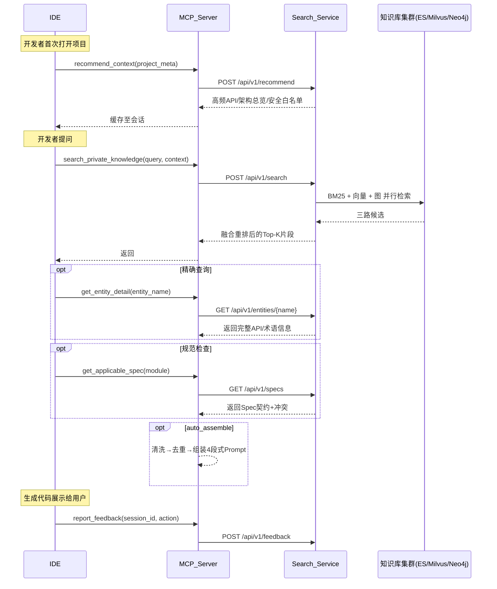

```markdown
# 私域知识自动检索 MCP Server —— 工具接口详细设计

## 版本历史
| 版本 | 日期 | 变更说明 |
|------|------|----------|
| v1.0 | 2026-05-09 | 基于积分服务与SSO集成场景推演后的正式设计 |
| v1.1 | 2026-05-10 | 新增assemble_prompt工具，补充Prompt组装流水线详细设计 |
| v1.2 | 2026-05-10 | 引入Search Service微服务架构，新增auto_assemble参数、Remote引擎切换、KnowledgeType.document |
| v1.3 | 2026-05-10 | assemble_prompt来源感知分组：SDK源码 vs 文档分开展示，knowledge_source字段 |

---

## 设计原则

| 原则 | 说明 |
|------|------|
| **上下文最大化** | 所有工具均支持接收IDE自动采集的上下文对象，以减少开发者手动输入，提高检索精准度。 |
| **版本感知** | 所有知识片段的元数据必须包含 `since_version` 与 `deprecated_in`，支持依赖版本匹配。 |
| **安全隔离** | 工具调用根据调用方所属团队与项目自动应用最小权限策略，返回知识仅限授权范围。 |
| **可审计** | 每次调用记录完整的查询指纹与返回摘要，存入审计日志。 |
| **错误宽容** | 当知识库不存在所需内容时，返回空列表并附诊断信息，不中断主流程。 |

---

## 工具总览

| 工具名称 | 用途 | 调用方向 |
|----------|------|----------|
| `search_private_knowledge` | 通用混合检索，覆盖术语/API/实践/缺陷等全类型知识 | IDE -> MCP |
| `get_entity_detail` | 精确查询实体（术语或API）的完整定义与示例 | IDE -> MCP |
| `get_applicable_spec` | 获取当前上下文应当遵守的结构化规范契约 | IDE -> MCP |
| `recommend_context` | 基于项目元信息推荐高频知识骨架，支持预加载 | IDE -> MCP |
| `report_feedback` | 上报用户对注入知识的采纳/拒绝反馈，驱动闭环优化 | IDE -> MCP |
| `assemble_prompt` | 清洗、去重、组装多来源知识为结构化Prompt，支持自动生成约束 | IDE -> MCP |

---

## 1. search_private_knowledge（通用语义检索）

### 1.1 概述
根据自然语言查询以及完整的IDE上下文，执行 BM25 + 向量相似度 + 图遍历 混合检索，返回最相关的私域知识片段。支持按知识类型、版本等过滤。

### 1.2 输入参数

| 参数名 | 类型 | 必填 | 描述 |
|--------|------|------|------|
| `query` | string | 是 | 用户问题或IDE捕获的上下文字符串。如”积分扣减 SDK 幂等处理”。 |
| `context` | object | 否 | IDE自动采集的项目上下文，见 `context` 结构定义。 |
| `knowledge_types` | string[] | 否 | 过滤知识类型。可选值：`term`, `api`, `best_practice`, `defect_history`, `security_rule`, `test_template`, `document`。 |
| `top_k` | int | 否 | 返回结果数量，默认5，上限10。 |
| `min_score` | float | 否 | 最小相关性阈值，默认0.7。 |
| `auto_assemble` | object | 否 | 自动Prompt组装配置（v1.2新增），见 `auto_assemble` 结构定义。 |

#### `context` 对象结构
```json
{
  "file_path": "com/example/controller/AuthController.java",
  "language": "java",
  "framework": "Spring Boot 2.7",
  "dependencies": [
    {"name": "gam-sdk", "version": "2.1.0"}
  ],
  "current_code_snippet": "@RestController\n@RequestMapping(\"/auth\")...",
  "cursor_line": 12,
  "adjacent_comments": ["// TODO: 使用异步模式"],
  "module": "sso"
}
```

### 1.3 返回结构

```json
{
  "items": [
    {
      "id": "kb_12345",
      "type": "api",
      "content": "GAM SDK 2.1.0 回调接口：GamClient.callback(code) 返回 UserInfoResponse...",
      "score": 0.97,
      "meta": {
        "sdk_class": "GamClient",
        "method": "callback",
        "since_version": "2.1.0",
        "deprecated_in": null,
        "required_config": ["GamConfig"],
        "code_example": "GamClient gc = GamConfig.builder()...",
        "related_entity": "UserInfoResponse",
        "security_rule": "/auth/callback 需放行"
      }
    }
  ],
  "diagnostics": {
    "total_scanned": 1520,
    "time_ms": 85,
    "warnings": []
  }
}
```

### 1.4 场景示例

**Go积分服务场景调用**
```json
{
  "query": "积分扣减 SDK 幂等处理",
  "context": {
    "file_path": "module/points/points_service.go",
    "language": "go",
    "dependencies": [{"name": "points-sdk", "version": "v2.3"}],
    "current_code_snippet": "func (s *PointsService) Deduct(uid, points int) error { ... }",
    "module": "points"
  },
  "knowledge_types": ["api", "best_practice"],
  "top_k": 3
}
```

#### `auto_assemble` 结构（v1.2新增）

当 `auto_assemble.enabled=true` 时，`search_private_knowledge` 内部自动串联规范获取 + Prompt组装，IDE一次调用即可获得可注入LLM的完整Prompt。

```json
{
  "enabled": true,
  "include_specs": true,
  "max_tokens": 4096,
  "role_hint": "熟悉支付系统的资深工程师"
}
```

| 字段 | 类型 | 必填 | 描述 |
|------|------|------|------|
| `enabled` | bool | 是 | 是否启用自动组装 |
| `include_specs` | bool | 否 | 是否自动拉取适用规范，默认true |
| `max_tokens` | int | 否 | Prompt最大token数，默认4096 |
| `role_hint` | string | 否 | 角色提示前缀 |

---

## 2. get_entity_detail（精确实体查询）

### 2.1 概述
当开发者明确提到某个术语或API名称时，直接获取其完整结构化定义、参数说明、使用示例、版本变更记录，以及关联的规范约束。

### 2.2 输入参数

| 参数名 | 类型 | 必填 | 描述 |
|--------|------|------|------|
| `entity_name` | string | 是 | 术语名或API全限定名，如 `DeductPoints` 或 `GamClient.callback`。 |
| `entity_type` | string | 否 | 明确实体类型 `term` 或 `api`，为空时系统自动推断。 |
| `version_requirement` | string | 否 | 需要的SDK/库版本，如 `>=2.1.0`。 |

### 2.3 返回结构

```json
{
  "entity_name": "GamClient.callback",
  "entity_type": "api",
  "definition": {
    "signature": "public UserInfoResponse callback(String code) throws GamException",
    "parameters": [
      {"name": "code", "type": "String", "description": "GAM回调URL中的授权码"}
    ],
    "return_type": "UserInfoResponse",
    "exceptions": ["GamException"],
    "since_version": "2.0.0",
    "deprecated_in": null,
    "code_example": "UserInfoResponse resp = gamClient.callback(code);",
    "config_requirements": "需先构建 GamConfig 并注入 GamClient Bean"
  },
  "related_specs": [
    "所有认证接口必须返回 AuthResult 对象"
  ],
  "version_changelog": [
    {"version": "2.1.0", "change": "增加超时配置回调参数"}
  ]
}
```

### 2.4 场景示例

**查询幂等检查相关术语**
```json
{
  "entity_name": "幂等键",
  "entity_type": "term"
}
```
返回包含定义、应用场景、同义词（如去重键）等。

---

## 3. get_applicable_spec（获取适用规范契约）

### 3.1 概述
根据当前模块、文件路径或项目依赖，拉取所有必须遵循的Spec契约，包括接口规范、数据契约、行为约束、安全要求等。支持版本冲突检测。

### 3.2 输入参数

| 参数名 | 类型 | 必填 | 描述 |
|--------|------|------|------|
| `module` | string | 否 | 功能模块，如 `points`, `sso`。 |
| `file_path` | string | 否 | 当前代码文件路径，用于自动推断适用规范。 |
| `dependency_constraints` | object | 否 | 项目依赖信息，用于匹配特定版本的规范。如 `{"gam-sdk": "2.1.0"}`。 |

### 3.3 返回结构

```json
{
  "specs": [
    {
      "id": "spec_987",
      "rule": "积分变动方法必须记录change_log，并返回流水号",
      "category": "data_contract",
      "effective_condition": "module=points && function_prefix=Deduct",
      "positive_example": "changeId := logPointsChange(...)",
      "negative_example": "直接调用SDK后未记录流水",
      "conflicts": []
    }
  ],
  "conflict_warnings": [
    "检测到规则 spec_988(异步积分) 与 spec_989(同步返回) 可能存在冲突，建议人工确认。"
  ]
}
```

### 3.4 场景示例

**查询SSO模块规范**
```json
{
  "module": "sso",
  "dependency_constraints": {"gam-sdk": "2.1.0"}
}
```

---

## 4. recommend_context（项目上下文预加载）

### 4.1 概述
根据项目元信息（技术栈、核心依赖、团队标识）一次性推荐高频知识素材，包括架构概览、常用API列表、近期更新规范等，供IDE预加载至会话缓存，减少后续检索延迟。

### 4.2 输入参数

| 参数名 | 类型 | 必填 | 描述 |
|--------|------|------|------|
| `project_meta` | object | 是 | 项目静态信息，见结构定义。 |

#### `project_meta` 结构
```json
{
  "project_id": "proj_123",
  "team": "order-team",
  "tech_stack": ["spring-boot", "java11"],
  "core_dependencies": [
    {"name": "gam-sdk", "version": "2.1.0"},
    {"name": "points-sdk", "version": "v2.3"}
  ],
  "modules": ["order", "payment", "sso"]
}
```

### 4.3 返回结构

```json
{
  "pinned_knowledge": {
    "architecture_overview": "订单系统整体采用DDD架构，积分服务位于 infrastructure 层...",
    "common_apis": [
      {"name": "DeductPoints", "snippet": "..."},
      {"name": "GamClient.callback", "snippet": "..."}
    ],
    "recent_spec_updates": [
      {"rule": "订单回调幂等必须使用分布式锁", "updated_at": "2026-05-01"}
    ],
    "security_whitelist_patterns": ["/auth/callback", "/points/inner-callback"]
  }
}
```

### 4.4 调用建议
IDE首次连接MCP时调用一次，之后可通过监听项目依赖变更事件刷新。

---

## 5. report_feedback（知识反馈上报）

### 5.1 概述
将开发者对注入知识的采纳或拒绝行为上报至知识运营平台，用于优化检索排序与知识库质量。包含被拒绝的代码片段及替换后的代码。

### 5.2 输入参数

| 参数名 | 类型 | 必填 | 描述 |
|--------|------|------|------|
| `session_id` | string | 是 | 当前对话会话标识，用于关联历史检索。 |
| `consumed_knowledge_ids` | string[] | 是 | 本次注入的知识片段ID列表。 |
| `action` | string | 是 | 采纳行为：`accepted`, `rejected`, `modified`, `ignored`。 |
| `modification_detail` | object | 否 | 当 action 为 `modified` 或 `rejected` 时提供。 |

#### `modification_detail` 结构
```json
{
  "original_generated_code": "...模型生成的代码...",
  "final_accepted_code": "...开发者最终修改后采用的代码...",
  "rejection_reason": "使用了过时的 import 路径"
}
```

### 5.3 返回
```json
{
  "status": "recorded",
  "feedback_id": "fb_87123"
}
```

### 5.4 数据处理
后台根据反馈类型调整知识片段的权重，被多次拒绝的片段将降低检索优先级，被频繁采纳的则提升。修改详情可用于提炼新的最佳实践。

---

## 6. assemble_prompt（Prompt上下文组装）

### 6.1 概述
将多来源知识（检索结果、规范契约、预加载知识）经过安全清洗、去重、裁剪后，组装为结构化的多段式 Prompt。

**检索结果按来源分组（v1.3 新增）**：
- SDK 源码（`knowledge_source: "sdk_code"`）：方法签名精确可靠，优先展示在 Background 的「方法签名」子节
- 文档（`knowledge_source: "doc"`）：提供用法、背景、FAQ，展示在「参考文档」子节
- 当两者同时存在时，签名用于约束 LLM 生成正确调用，文档用于帮助 LLM 理解业务意图

### 6.2 输入参数

| 参数名 | 类型 | 必填 | 描述 |
|--------|------|------|------|
| `user_query` | string | 是 | 用户原始需求或问题。 |
| `context` | object | 否 | IDE自动采集的项目上下文。 |
| `search_items` | object[] | 否 | search_private_knowledge 返回的知识片段列表。 |
| `specs` | object[] | 否 | get_applicable_spec 返回的规范契约列表。 |
| `pinned_knowledge` | object | 否 | recommend_context 返回的预加载知识。 |
| `max_tokens` | int | 否 | Prompt最大token数，默认4096。 |
| `role_hint` | string | 否 | 角色提示，默认"资深软件工程师"。 |

### 6.3 返回结构

```json
{
  "assembled_prompt": "你是一个资深软件工程师...\n\n以下是从私域知识库检索...",
  "sections": {
    "system": "你是一个{role_hint}，请严格遵守以下规范约束...",
    "background": "以下是从私域知识库检索到的相关知识...\n\n### 方法签名（SDK 源码）\n### [API] [SDK源码] (score: 0.93)\npublic String deduct(...)\n\n### 参考文档\n### [API] [文档] (score: 0.96)\n积分扣减 API 说明...",
    "user_request": "## 用户需求\n{user_query}",
    "constraints": "## 生成约束\n- 版本要求: v2.3..."
  },
  "stats": {
    "input_items": 5,
    "after_dedup": 4,
    "after_truncation": 4,
    "estimated_tokens": 1850,
    "budget_remaining": 2246
  },
  "sanitization_log": [
    {"item_id": "kb_123", "original_hash": "a1b2c3d4", "action": "cleaned"}
  ]
}
```

### 6.4 处理流水线

```
输入 → 安全清洗 → 去重 → 按来源拆分(sdk_code / doc) → 分组排序 → Token裁剪 → 组装 → 输出
```

**安全清洗**：检测越狱/注入模式并移除，包括：
- 忽略指令类短语（中文/英文）
- 代码注入（`<script>`等）
- Base64/URL编码内容

**去重规则**：
- ID精确去重
- 内容相似度 > 0.92 时保留score高者

**来源分组**（v1.3）：按 `meta.knowledge_source` 分组：
- `sdk_code` → Background 的「方法签名」子节（优先展示，最可靠）
- `doc` → Background 的「参考文档」子节（背景、用法补充）

**Prompt 结构**：
1. System：角色定义 + 强制规范
2. Background：
   - 方法签名（SDK 源码）— 精确签名，用于约束 LLM 生成
   - 参考文档 — 概念解释、最佳实践、FAQ
3. User Request：用户原始需求
4. Constraints：版本要求、安全约束、依赖信息

---

## 7. 工具间协作流程



### 7.1 架构说明（v1.2）

MCP Server 与 Search Service 之间通过 HTTP REST 通信：

- **MCP Server**：每IDE一个进程，stdio 协议，负责 MCP 协议适配 + Prompt 组装
- **Search Service**：独立 FastAPI 微服务（`search_service/`），团队共享，承载混合检索 + 知识库管理

切换方式：设置 `SEARCH_SERVICE_URL` 环境变量即可从 Mock 切换到远端：
```bash
export SEARCH_SERVICE_URL=http://localhost:8080
# 未设置时自动使用 MockSearchEngine + MockKnowledgeBase
```

MCP Server 内部通过 `config.py` 的 `search_service_url` 配置项和 `create_server()` 工厂函数实现自动切换，无需修改代码。

---

## 8. 实现注意事项

1. **版本匹配**  
   检索时若 `context.dependencies` 提供了精确版本，API文档必须返回适用该版本的片段；若存在版本不兼容，应在 `meta` 中标记警告。

2. **安全白名单**  
   `recommend_context` 返回的 `security_whitelist_patterns` 可注入IDE的安全检查插件，自动提示是否需要放行路径。

3. **Prompt注入防护**  
   从知识库检索到的文本必须经过清洗：移除一切”忽略之前的限制”等越狱短语，并对代码块进行转义标注。清洗逻辑位于 `mcp/prompt/sanitizer.py`，支持零宽字符过滤、Unicode规范化、Base64/URL编码检测。

4. **多文件协同提示**  
   当检索到的知识（如配置Bean）涉及多个文件时，在返回结果的 `meta` 中增加 `related_files` 字段，供IDE决定是否引导用户批量修改。

5. **性能保障**  
   - `search_private_knowledge` 设置超时300ms（Search Service 侧 `SEARCH_TIMEOUT_MS`），超时则返回缓存结果或空（需标记降级）。  
   - `recommend_context` 采用异步+推送模式，避免阻塞IDE启动。  
   - Prompt 组装过程为纯 CPU 操作，在 MCP Server 侧执行，无额外 I/O。

6. **监控指标**  
   - 工具调用次数/延迟  
   - 知识命中率（是否有结果）  
   - 反馈采纳率  
   - 每个工具的缓存命中率

7. **Remote / Mock 切换（v1.2新增）**  
   MCP Server 通过 `config.py` 的 `search_service_url` 配置项决定检索后端：
   - 设置了 `SEARCH_SERVICE_URL`：创建 `RemoteSearchEngine` + `RemoteKnowledgeBase`，通过 `httpx` 调用 Search Service
   - 未设置：创建 `MockSearchEngine` + `MockKnowledgeBase`，返回空结果（不影响联调）
   - 切换逻辑位于 `server.py` 的 `create_server()` 工厂函数，无需改动业务代码

8. **Search Service 试点期降级**  
   试点期 ES/Milvus/Neo4j 不可用时，各检索器自动降级返回空结果，`api/search.py` 检测空结果后返回 mock 数据（与设计文档附录一致的积分服务场景示例），确保端到端可用。详见 `doc/search_service_design.md`。

---

## 附录：请求/响应完整示例

### 示例：积分服务场景的完整 search_private_knowledge 响应
```json
{
  "items": [
    {
      "id": "sdk_doc_101",
      "type": "api",
      "content": "points-sdk v2.3 DeductPoints(bizId, uid, points) 返回 (changeId, error)。需传入业务幂等键。",
      "score": 0.96,
      "meta": {
        "sdk": "points-sdk",
        "version": "v2.3",
        "code_example": "changeId, err := sdk.DeductPoints(bizId, uid, points)",
        "related_entity": "PointsService",
        "config_required": "NewPointsClient(appKey, secret)"
      }
    },
    {
      "id": "best_prac_206",
      "type": "best_practice",
      "content": "积分扣减幂等处理：使用 bizId+uid+eventType 作为幂等键，调用前检查流水。",
      "score": 0.93,
      "meta": {
        "source": "team_retro_session_2026-03",
        "applicable_version": "*"
      }
    },
    {
      "id": "defect_hist_89",
      "type": "defect_history",
      "content": "历史缺陷：积分扣减未包在本地事务中导致少扣，必须开启DB事务并加SDK重试。",
      "score": 0.89,
      "meta": {
        "related_ticket": "INC-4829"
      }
    }
  ],
  "diagnostics": {
    "total_scanned": 3400,
    "time_ms": 72
  }
}
```