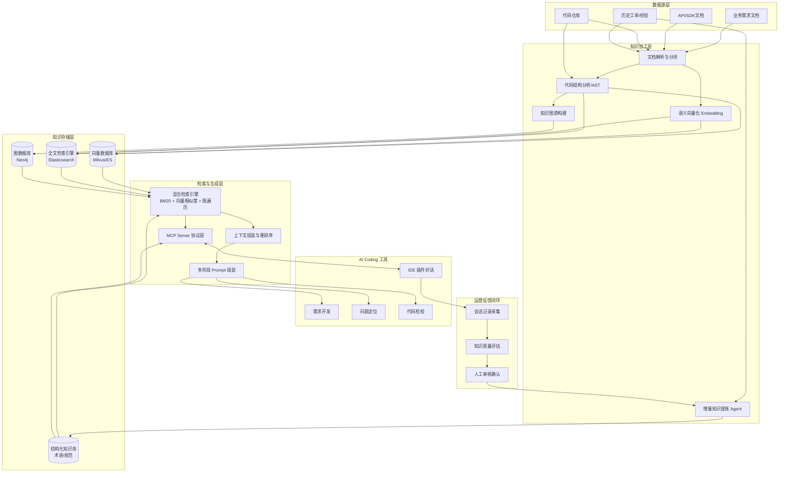

# 私域知识赋能AI Coding工具技术方案

## 1. 项目背景与目标

### 1.1 问题陈述
- 通用AI编程模型缺乏对企业内部术语、私有SDK、历史技术决策和团队规范的理解。
- 开发者需多次“调教”才能获得可用代码，返工率高（常见需5轮以上修改）。
- 现有工具在遗留代码库中表现出“项目级理解缺失”（据调研63%的开发者有此感受）。

### 1.2 建设目标
构建以**私域知识工程**为核心的技术体系，实现：
- AI自动理解企业术语、API、业务规范与历史经验。
- 在**需求开发、问题定位、代码检视**三大场景中，提供符合企业规范的精准生成与建议。
- 通过**运营闭环**持续积累与优化知识，使AI从“通用码农”升级为“业务专家型Copilot”。

---

## 2. 总体技术架构

### 2.1 设计思想：Spec + RAG 双引擎
- **Spec引擎**：将接口契约、数据契约、行为规范等结构化知识作为硬约束，在生成前进行校验。
- **RAG引擎**：通过语义检索动态注入非结构化知识（历史方案、API文档、最佳实践等），实现软智能。

### 2.2 系统架构图（文字描述）
```
[数据源层]
  业务需求文档、API/SDK文档、代码仓库、历史工单/经验
      ↓
[知识加工层]
  文档解析分块、代码AST分析、语义向量化、知识图谱构建、增量知识提炼Agent
      ↓
[知识存储层]
  向量数据库(Milvus等) | 全文索引(ES) | 图数据库(Neo4j) | 结构化知识库(术语/规范)
      ↓
[检索与生成层]
  混合检索引擎(BM25+向量+图遍历) → MCP Server协议层 → 上下文组装与重排序 → 多阶段Prompt组装
      ↓
[AI Coding工具]
  IDE插件 → 需求开发 / 问题定位 / 代码检视
      ↑
[运营反馈闭环]
  会话记录采集 → 知识质量评估 → 人工审核确认 → 反馈至知识加工层
```
### 2.3 数据流转图


---

## 3. 私域知识库构建方案

### 3.1 知识分类与结构化定义
| 知识类别 | 内容构成 | 结构化格式示例 |
|----------|----------|----------------|
| **术语/业务词汇库** | 术语名、定义、适用场景、同义词、关联术语 | `{term, definition, context, synonyms, related}` |
| **SDK/API文档库** | 接口签名、参数说明、返回值、示例代码、版本变更记录 | `{api, method, params[], returns, example, changelog}` |
| **代码规范与最佳实践** | 命名规则、异常处理模式、性能优化手段、缺陷修复模板、Spec契约 | 契约文件（JSON/YAML）、Markdown模板 |
| **历史上下文库** | 缺陷记录（现象/根因/方案）、架构评审纪要、技术决策文档 | 结构化标签+长文本摘要 |

### 3.2 数据预处理流程
1. **文档分块与向量化**
   - 采用语义边界识别 + 重叠窗口策略，单块控制在 3K~5K token。
   - 使用Embedding模型（如bge-large-zh）生成稠密向量，存入向量数据库。
2. **代码知识图谱构建**
   - 通过AST解析提取函数、类、模块间依赖关系。
   - 构建调用关系图、继承图，支持跨文件变量级依赖分析（参考RANGER方法）。
   - 存入图数据库，支持复杂推理检索。
3. **混合索引建设**
   - **向量库**（Milvus/Qdrant）：存储文档、代码片段向量。
   - **全文检索引擎**（Elasticsearch）：存储原始文本，支持BM25稀疏检索。
   - **图数据库**（Neo4j）：存储代码知识图谱。
   - 检索时采用“BM25 + 向量相似度 + 图遍历”混合策略，并通过Cross-BERT重排序提升精准度（目标召回率>92%）。

### 3.3 知识库管理工具
- 可选用**JeecgBoot低代码知识库节点**等产品化方案，提供可视化配置TopK、相似度阈值等参数，降低构建成本。
- 支持知识增量更新、版本管理、权限隔离。

---

## 4. 私域知识自动检索方案

### 4.1 三大触发机制
| 机制 | 触发方式 | 实现要点 |
|------|----------|----------|
| **对话上下文自动触发** | 识别用户输入中的业务术语、API名、方法名，匹配私域知识库 | 关键词匹配 + 语义向量相似度 + IDE当前文件上下文感知 |
| **知识图谱关联触发** | 检测到某一实体后，自动加载图谱关联路径上的相关知识 | 利用图遍历查找API关联的文档、历史方案、编解码规范等 |
| **项目上下文自适应触发** | 通过MCP协议获取IDE当前项目信息（文件、依赖、分支），预判所需知识 | 主动预注入架构概览、对应模块规范等背景知识 |

### 4.2 MCP协议集成方案
- **模型上下文协议（MCP）** 让AI工具能够直连企业内部数据库、仓库、微服务。
- **私域知识MCP Server**：将知识检索能力封装为标准化工具，暴露给IDE（如VS Code、Cursor）。
- 交互流程：
  1. 开发者在IDE中提问。
  2. IDE自动提取上下文，调用MCP Server请求相关知识。
  3. MCP Server执行混合检索，返回Top-K知识片段。
  4. IDE将知识片段与用户问题、当前上下文组装成多段式Prompt。
  5. LLM生成精准代码或建议。

### 4.3 检索效果保障
- **混合检索+重排序**：BM25 + 向量相似度 + 图遍历初筛，Cross-BERT重排序（实测召回率可达92.3%）。
- **上下文剪枝**：对返回片段去重、按相关性截断，避免Token浪费。
- **多阶段Prompt模板**：系统指令（角色+规范） → 检索知识作为背景 → 用户问题 → 约束条件→ 生成。

---

## 5. 应用场景落地细节

### 5.1 需求开发
- **注入知识**：业务术语映射的API接口、历史同类需求方案、模块代码规范、参考实现。
- **工作流**：
  1. 用户描述需求（如“实现订单支付回调”）。
  2. 系统自动检索“订单支付”关联的私有SDK接口文档、幂等性规范、历史支付模块代码。
  3. 组装Prompt，生成符合企业规范的代码骨架+业务逻辑。
- **目标效果**：需求匹配度从通用60%提升至95%以上，沟通返工时间减少50%。

### 5.2 问题定位
- **注入知识**：根据异常堆栈、日志关键词匹历史同类缺陷、关联模块维护文档。
- **触发条件**：检测到错误关键词（error/exception）或否定表达（不对、错了）。
- **工作流**：
  1. 用户贴入报错信息。
  2. 系统检索历史相似缺陷（现象+根因+修复方案），同时拉取相关API的最新变更记录。
  3. 自动生成排查建议或修复代码。
- **目标效果**：问题修复时间缩短40%，降低专业门槛。

### 5.3 代码检视
- **注入知识**：Spec契约（命名规则、异常处理模板）、团队编码规范、安全规范。
- **工作流**：
  1. 开发者发起Code Review请求。
  2. 系统自动拉取Spec规范库，解析当前代码差异。
  3. 对违规的命名、缺失的异常处理、潜在性能问题标记并建议修复方案。
- **目标效果**：代码审查效率大幅提升，不合规项自动拦截。

---

## 6. 长效运营与持续优化

### 6.1 增量知识运营
- **会话经验自动捕获**：遵循“信号识别 → 候选筛选 → 知识提炼 → 去重聚合”流水线（参考天猫AI Coding实践）。
  - 实时采集AI对话和代码变更。
  - 通过质量评分算法筛选有价值片段。
  - 提取结构化知识（问题-方案对、常用API组合等）。
- **实时更新机制**：对接SDK发布源（GitHub Release、RSS）、内部通知，自动触发知识库版本更新。

### 6.2 深度适配方案（可选进阶）
- **增量预训练+后训练**：将高质量私域数据注入代码基座模型，aiXcoder实践显示准确率可从20%提升至45%。
- **大小模型协同**：大模型负责通用Agent主流程，小模型处理企业特定规范检查与精准补全，平衡效果与推理成本。

### 6.3 数据闭环与质量评估
- **反馈闭环**：
  - 采集采纳率、否定反馈频率、互动轮次等指标。
  - 低质量知识下调权重或人工复核，优质知识提升检索优先级。
- **安全与权限**：
  - 知识源按项目/团队隔离，检索结果遵循最小权限原则。
  - 全链路操作留痕（日志记录查询内容、注入知识片段），满足审计要求。

---

## 7. 实施路径与里程碑

### 7.1 试点阶段（1-2个月）
- **范围**：选择一个核心业务域（如订单、支付）。
- **任务**：
  - 梳理该领域知识资产（术语、SDK文档、规范、历史缺陷）。
  - 搭建RAG基础链路（向量库+ES+混合检索）。
  - 开发简易MCP Server接入IDE。
  - 验证需求开发场景，对比采纳率提升数据。

### 7.2 推广阶段（3-4个月）
- **任务**：
  - 扩展到3-5个主要业务域。
  - 引入代码AST解析与图谱构建，覆盖代码检视场景。
  - 集成运营反馈闭环，实现知识自动提炼。
  - 制定知识库维护规范（更新周期、审核制度）。

### 7.3 深化阶段（5-6个月）
- **任务**：
  - 全团队知识基线运营。
  - 根据反馈数据优化检索重排序模型。
  - 评估进阶方案（增量预训练）的需求与ROI。
  - 建设知识质量仪表盘，监控知识命中率、采纳率等。

---

## 8. 技术选型推荐

| 组件 | 推荐方案 | 备注 |
|------|----------|------|
| 向量数据库 | Milvus / Qdrant | 支持高并发、混合检索 |
| 全文引擎 | Elasticsearch | 支持BM25与文本分析 |
| 图数据库 | Neo4j | 适用于代码知识图谱 |
| 大模型 | 企业内私有部署LLM或API（如DeepSeek-Coder） | 注意数据隐私安全 |
| RAG框架 | LangChain / LlamaIndex | 快速搭建检索链 |
| MCP框架 | 开源MCP SDK（Python/TS） | 标准化工具暴露 |
| 文档解析 | Unstructured / Apache Tika | 多格式文档处理 |
| 低代码平台 | JeecgBoot知识库节点（可选） | 轻量级管理界面 |

---

## 9. 风险与应对

| 风险点 | 应对措施 |
|--------|----------|
| 知识库陈旧导致AI输出过期API | 建立自动监听更新管道，知识条目强制关联有效期 |
| 检索延迟影响IDE体验 | 缓存热门知识，向量库采用GPU加速，异步预取当前项目知识 |
| 私域数据泄露至外部模型 | 严格控制MCP Server的访问范围，部署私有LLM或使用企业级API（不传输至境外） |
| 检索结果噪音大 | 持续优化分块策略与重排序模型，引入用户反馈信号 |

---

## 10. 附录：Prompt组装示例（需求开发）

```
System:
你是一个熟悉{公司名}支付系统的资深工程师，严格遵守《{支付规范Spec}》。

Background Knowledge:
{检索到的最佳实践1}: 处理支付回调必须实现幂等性，基于订单号+支付流水去重。
{检索到的API文档}: IPaymentService.confirm(orderId, transactionId) 接口签名与异常处理说明。

User Request:
请为我的项目生成处理微信支付回调的代码，要求符合公司规范。

Generated Code:
(根据上述上下文生成代码，包含幂等性检查、异常处理日志)
```

---

## 11. 实现待办跟踪

以下为试点阶段已识别但尚未实施的事项：

| 编号 | 事项 | 描述 | 优先级 |
|------|------|------|--------|
| P1 | 企业私域数据准备 | 梳理试点业务域的知识资产：SDK 源码（Java/Python 多仓）、API 文档（JSON 数组 + MD 混合）、Spec 契约文件 | HIGH |
| P2 | JSON API 文档 loader | `pipeline/loader.py` 新增 JSON 数组展开逻辑，将每个 API 条目映射为独立 chunk，字段映射支持可配置 | MEDIUM |
| P3 | Python SDK AST 解析 | 参照 `code_parser.py` 的 Java 实现，用 `ast` 标准库解析 Python 源码，提取 `setup.py`/`pyproject.toml` 包名版本 | MEDIUM |
| P4 | LLM 文档分类 | 替换 `pipeline/classifier.py` 的规则匹配：将文档前 N 行送入大模型，返回分类标签 + API 章节边界，详见 classifier.py 头部 TODO | MEDIUM |
| P5 | 生产后端部署对接 | 部署 Docker 环境（ES + Milvus + Neo4j），切换 `BACKEND_MODE=production`，验证 engine 三路检索；提供 `docker-compose.yml` | MEDIUM |
| P6 | 增量更新管道 | Pipeline 当前全量覆写。需支持 source_path → chunk_id 映射，对比文件修改时间，仅重处理变更文件 | LOW |
| P7 | orchestrator 生产模式适配 | 当前 `orchestrator.py` 绕过 factory 直接实例化 Lite* 类，生产模式下需调整为通过 factory 获取实例 | LOW |
| P8 | 全链路端到端验证 | 用企业真实数据跑通：数据导入 → 索引 → Search Service 检索 → MCP Server → assembled prompt 输出 | HIGH |
| P9 | 反馈闭环权重调整 | 当前 `report_feedback` 仅记录 feedback_id（`search_service/api/feedback.py`）。需实现：根据 rejected/modified 次数下调知识片段权重，accepted 提升优先级；修改详情提炼为新最佳实践。对应 requirement.md 第 6.3 节 | MEDIUM |
| P10 | MCP 工具触发率优化 | 当前工具描述已添加中文关键词和触发场景（`inner_sdk_search_mcp/server.py`）。后续优化方向：(1) 在 IDE system prompt 中注入指令——"当用户询问内部SDK、企业私有组件时，必须先调用 search_private_knowledge"；(2) 基于 `recommend_context` 在会话启动时预热项目骨架知识，让 LLM 在用户提问前就感知到可用内部 SDK 列表 | MEDIUM |

--- 

*本方案文档可直接复制为Markdown文件，用于团队内部实施方案或项目启动评审。*